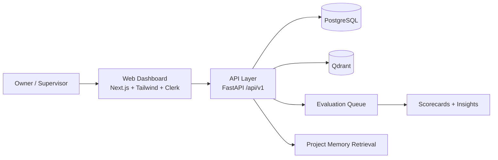

# Synapse_OS

<p align="center">
  <b>SentientOps V1 Foundation</b><br/>
  A project-centric operating system for multi-agent execution, memory continuity, and evaluator-driven quality.
</p>

<p align="center">
  
  
  
  
</p>

## Vision
`Synapse_OS` is the operating backbone for multi-agent projects.
It standardizes how manager agents coordinate workers, preserves context across long task chains, and gives owners a transparent control room for execution quality.

## Why This Exists
- Multi-agent systems lose context across long workflows.
- Handoffs are inconsistent and often low-signal.
- Owners lack consistent, project-level visibility into execution quality.
- Evaluations are rarely first-class and auditable.

Synapse_OS addresses this with structured workflows, persistent memory, and evaluator-driven scoring.

## Current Scope (Foundation Release)
- Monorepo scaffold for `FastAPI` backend + `Next.js` frontend.
- Core API groups under `/api/v1`.
- Strong policy guardrails for V1 operating rules.
- Memory architecture with raw vs curated promotion model.
- Agent operating docs (`AGENTS.md`, `PRIMER.md`, `NEXT.md`, `CLAUDE.md`).

## System Snapshot



## Tech Stack
| Layer | Choice |
|---|---|
| Backend | Python, FastAPI, SQLAlchemy, Alembic |
| Frontend | Next.js, Tailwind CSS |
| Auth | Clerk |
| Relational DB | PostgreSQL |
| Vector DB | Qdrant |
| Package/Workspace | pnpm monorepo |

## Monorepo Layout
```text
apps/
  api/          # FastAPI app, schemas, policies, alembic
  web/          # Next.js app shell, dashboard routes, auth middleware
packages/
  contracts/    # Shared TS contracts + OpenAPI generation scaffold
ops/            # Docker compose + bootstrap/dev scripts
docs/           # Architecture and ADRs
memory/         # Decisions, handoffs, runbooks, research, changelog
```

## Quickstart (Windows / PowerShell)
```powershell
python -m venv .venv
.\.venv\Scripts\python.exe -m pip install -e .\apps\api[dev]
npm install -g pnpm@10.18.0
pnpm install
docker compose -f .\ops\docker-compose.yml up -d
pnpm dev:api
pnpm dev:web
```

## API Surface
Namespace: `/api/v1`

- `projects`: create/update/archive + manager designation
- `agents`: register/update/status
- `tasks`: create/assign/claim/status/dependencies
- `worklogs`: append structured entries
- `handovers`: create + timeline retrieval
- `memory`: fetch/search/promote
- `evaluations`: request/submit/owner override (audited)
- `agent-tools`: machine-oriented tool invocation API for AI agents

## Agent-First Integration
Agent auth (recommended):
```http
Authorization: Bearer soa_dev_agent_key
```

Discover tools:
```bash
curl http://localhost:8000/api/v1/agent-tools/manifest \
  -H "Authorization: Bearer soa_dev_agent_key"
```

Call a tool:
```bash
curl -X POST http://localhost:8000/api/v1/agent-tools/create_project \
  -H "Authorization: Bearer soa_dev_agent_key" \
  -H "Content-Type: application/json" \
  -H "Idempotency-Key: create-project-001" \
  -d '{
    "name": "Project Atlas",
    "description": "Agent-run delivery workflow",
    "objective": "Build V1 vertical slice",
    "owner": "owner-1",
    "status": "active",
    "tags": ["agentic", "v1"]
  }'
```

## MCP Compatibility
- MCP server is mounted on `/mcp` (when enabled).
- Same backend tools are exposed via MCP (`tool_manifest`, `call_tool`).
- Run stdio MCP server:
  ```powershell
  .\.venv\Scripts\python.exe -m app.mcp.server
  ```

## V1 Guardrails
- One manager per project.
- Assigned-worker-only task claiming.
- Completion can trigger evaluator workflow.
- Owner override allowed with immutable audit history.
- Hybrid memory promotion (suggest + approve).
- Subtask autonomy allowed with configurable limits.

## Documentation Index
- [Product Primer](./PRIMER.md)
- [Agent Operating Contract](./AGENTS.md)
- [Current Execution Queue](./NEXT.md)
- [Agent Integration Architecture](./docs/architecture/agent-integration.md)
- [Public Roadmap](./ROADMAP.md)
- [Showcase Notes](./SHOWCASE.md)

## Validation
- Backend tests: `apps/api/tests/test_policies.py`, `apps/api/tests/test_schemas.py`
- Web build: production build passes locally.
- Contracts build: TypeScript contracts compile.

## Build Notes
- Clerk auth is strict for application routes (`/`, `/projects`, `/tasks`, `/agents`, `/evaluations`, `/tools`).
- `NEXT_PUBLIC_CLERK_PUBLISHABLE_KEY` and `CLERK_SECRET_KEY` must be configured for runtime access.
- Frontend includes a full operator UI: Dashboard, Projects, Tasks (Kanban + Inspector), Agents, Evaluations, Tool Console.

## Road To MVP
See [`ROADMAP.md`](./ROADMAP.md) for the planned progression from foundation scaffold to full end-to-end pilot.
