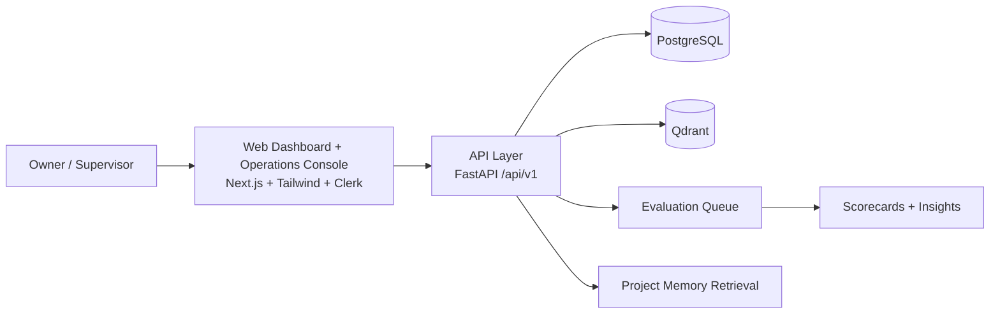

# Synapse_OS

<p align="center">
  <b>SentientOps V1</b><br/>
  An agent-first operating system for project execution, workflow control, memory continuity, and evaluator-driven quality.
</p>

<p align="center">
  
  
  
  
</p>

## Vision
`Synapse_OS` is the operating backbone for multi-agent projects.
It standardizes how manager agents coordinate workers, preserves context across long task chains, and gives owners a transparent control room for execution quality.

## Why This Exists
- Multi-agent systems lose context across long workflows.
- Handoffs are inconsistent and often low-signal.
- Owners lack consistent, project-level visibility into execution quality.
- Evaluations are rarely first-class and auditable.

Synapse_OS addresses this with structured workflows, persistent memory, and evaluator-driven scoring.

## Current Scope
- Production-shaped monorepo for `FastAPI` backend + `Next.js` frontend.
- Agent-first workflow engine with Kanban board, task inspector, evaluations, tool console, and a dedicated operations console.
- Strong policy guardrails for V1 operating rules.
- Memory architecture with raw vs curated promotion model.
- OpenAI-based tester agents for realistic UAT against the live local stack.
- Agent operating docs (`AGENTS.md`, `PRIMER.md`, `NEXT.md`, `CLAUDE.md`).

## System Snapshot



## Tech Stack
| Layer | Choice |
|---|---|
| Backend | Python, FastAPI, SQLAlchemy, Alembic |
| Frontend | Next.js, Tailwind CSS |
| Auth | Clerk |
| Relational DB | PostgreSQL |
| Vector DB | Qdrant |
| Package/Workspace | pnpm monorepo |

## Monorepo Layout
```text
apps/
  api/          # FastAPI app, schemas, policies, alembic
  web/          # Next.js app shell, dashboard routes, auth middleware
  tester/       # OpenAI Agents SDK UAT harness + Playwright browser tooling
packages/
  contracts/    # Shared TS contracts + OpenAPI generation scaffold
ops/            # Docker compose + bootstrap/dev scripts
docs/           # Architecture and ADRs
memory/         # Decisions, handoffs, runbooks, research, changelog
```

## Implemented Now
- Workflow-driven task lifecycle:
  `intake -> ready -> assigned -> in_progress -> awaiting_handover -> under_review -> evaluation -> completed`
- Side states:
  `blocked`, `reopened`
- Agent-first UI:
  Dashboard, Projects, Operations, Tasks, Agents, Evaluations, Tool Console
- Project operations console:
  project-scoped staffing, manager-slot assignment, project agent attach/detach/create, recent activity feed
- Seamless structured logging:
  shared quick-log composer reused in both project operations and task inspection flows
- Realtime foundation:
  SSE stream + polling fallback for board, staffing, and worklog activity surfaces
- Auth modes:
  Clerk for app users, agent API key for `/agent-tools`, local tester auth for UAT
- Testing:
  OpenAI tester agents simulate realistic project leads and workers, exercise APIs/MCP/UI including `/operations`, and produce reports

## Quickstart (Windows / PowerShell)
```powershell
python -m venv .venv
.\.venv\Scripts\python.exe -m pip install -e .\apps\api[dev]
.\\.venv\\Scripts\\python.exe -m pip install -e .\\apps\\tester
npm install -g pnpm@10.18.0
pnpm install
pnpm dev:api
pnpm dev:web
```

For a Docker-less local run, set:
```env
DATABASE_URL=sqlite:///./sentientops.db
```

## API Surface
Namespace: `/api/v1`

- `projects`: create/update/archive + manager designation + project staffing read model
- `agents`: register/update/status + project attach/detach flows
- `tasks`: create/assign/claim/transition/status/dependencies
- `worklogs`: append structured entries + filtered project/task/agent activity reads
- `handovers`: create + timeline retrieval
- `memory`: fetch/search/promote
- `evaluations`: request/submit/owner override (audited)
- `agent-tools`: machine-oriented tool invocation API for AI agents
- `boards`: Kanban read model for workflow lanes and cards
- `events`: SSE event stream for project activity
- `process`: default process template/bootstrap

## Agent-First Integration
Agent auth (recommended):
```http
Authorization: Bearer soa_dev_agent_key
```

Discover tools:
```bash
curl http://localhost:8000/api/v1/agent-tools/manifest \
  -H "Authorization: Bearer soa_dev_agent_key"
```

Call a tool:
```bash
curl -X POST http://localhost:8000/api/v1/agent-tools/create_project \
  -H "Authorization: Bearer soa_dev_agent_key" \
  -H "Content-Type: application/json" \
  -H "Idempotency-Key: create-project-001" \
  -d '{
    "name": "Project Atlas",
    "description": "Agent-run delivery workflow",
    "objective": "Build V1 vertical slice",
    "owner": "owner-1",
    "status": "active",
    "tags": ["agentic", "v1"]
  }'
```

## MCP Compatibility
- MCP server is mounted on `/mcp` (when enabled).
- Same backend tools are exposed via MCP (`tool_manifest`, `call_tool`).
- Run stdio MCP server:
  ```powershell
  .\.venv\Scripts\python.exe -m app.mcp.server
  ```

## V1 Guardrails
- One manager per project.
- Assigned-worker-only task claiming.
- Completion can trigger evaluator workflow.
- Owner override allowed with immutable audit history.
- Hybrid memory promotion (suggest + approve).
- Subtask autonomy allowed with configurable limits.

## Documentation Index
- [Product Primer](./PRIMER.md)
- [Agent Operating Contract](./AGENTS.md)
- [Current Execution Queue](./NEXT.md)
- [Agent Integration Architecture](./docs/architecture/agent-integration.md)
- [OpenAI Tester Harness](./docs/architecture/openai-uat-harness.md)
- [Public Roadmap](./ROADMAP.md)
- [Showcase Notes](./SHOWCASE.md)

## Validation
- Backend tests: `15 passed`
- Web build: production build passes locally
- UAT harness: OpenAI tester agents generate Markdown + JSON reports under `reports/uat/`

## Build Notes
- Clerk auth is strict for application routes (`/`, `/projects`, `/operations`, `/tasks`, `/agents`, `/evaluations`, `/tools`).
- `NEXT_PUBLIC_CLERK_PUBLISHABLE_KEY` and `CLERK_SECRET_KEY` must be configured for runtime access.
- Frontend includes a full operator UI: Dashboard, Projects, Operations, Tasks (Kanban + Inspector), Agents, Evaluations, Tool Console.

## OpenAI Tester Agents
- New tester harness lives in `apps/tester` and uses the OpenAI Agents SDK plus Playwright for UAT simulation.
- Root commands:
  - `pnpm qa:uat`
  - `pnpm qa:uat:blocked`
  - `pnpm qa:uat:agent`
  - `pnpm qa:uat:ux`
- Reports are written to `reports/uat/` and include both JSON and Markdown outputs plus optional screenshots.
- Local browser UAT is designed to run with `SENTIENTOPS_TESTER_AUTH_MODE=local_bypass` in `apps/web/.env.local`.

## Current Focus
- Gathering first-pass tester feedback for the new operations console and staffing workflow
- Hardening the evaluator queue processor and worker automation
- Improving browser-UAT reliability and agent ergonomics
- Expanding SSE coverage and tightening workflow interaction polish

## Road To MVP
See [`ROADMAP.md`](./ROADMAP.md) for the planned progression from foundation scaffold to full end-to-end pilot.
